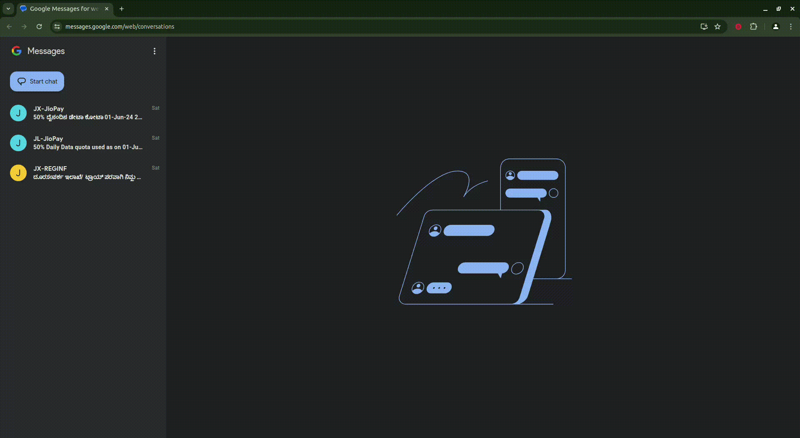

# Google Messages Web Extension

Chrome Extension to enhance the functionality of **Google Messages for Web** by providing additional features for managing messages.

## Features

1. **Create Check Box** : Inserts an checkbox next to each message for easy selection
2. **Select All** : Marks the checkbox next to each message as checked
3. **Delete Selected** : Deletes the messages where the checkbox is checked

## Installation

To install the extension, follow these steps :

1. Download the extension files
2. Open Google Chrome
3. Go to the menu in the top right corner
4. Choose "Extensions" > "Manage Extensions"
5. Enable "Developer Mode" by toggling the switch in the top right corner
6. Click on "Load unpacked" and select the folder containing the extension files
7. The extension should now be installed and visible in the list of extensions

## Usage

1. Navigate to Google Messages for Web ( https://messages.google.com/web/conversations )
2. Click on the extension icon in the toolbar to open the popup
3. Use the buttons in the popup to perform the desired actions

## Contributing

Contributions are welcome. If you have ideas for new features or improvements, feel free to open an issue or submit a pull request.

## License

This project is licensed under the GPL-3.0 License - see the [LICENSE](LICENSE) file for details.
